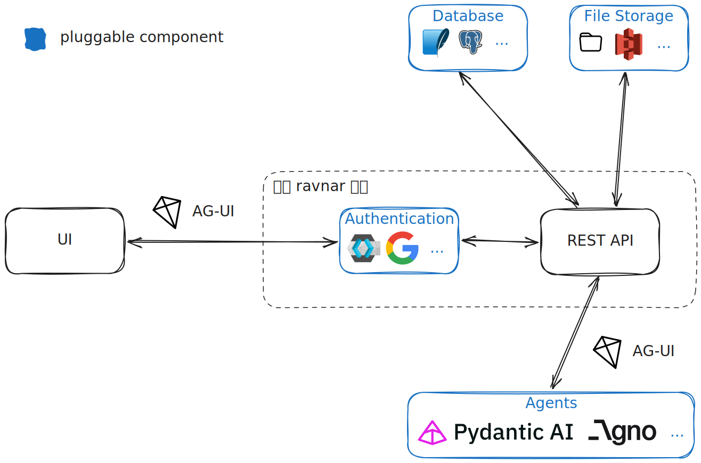

# 🐦‍⬛ ravnar 🐦‍⬛

Fully-fledged, pluggable [AG-UI](https://ag-ui.com) server.

<!-- prettier-ignore-start -->
> [!CAUTION]
> ravnar is very much in an alpha state. There are still lots of moving parts. In most
> places the code does **not** represent the quality of the finished product.
<!-- prettier-ignore-end -->

## How do I get started?

```shell
docker run \
    --name ravnar --rm --pull always \
    --env RAVNAR_SERVER__LOGGING__AS_JSON=false \
    --publish 8000:8000 \
    quay.io/nebari/ravnar:latest
```

## What does the architecture look like?



## How can I learn more?

Please have a look at the [documentation](https://ravnar.readthedocs.io).
